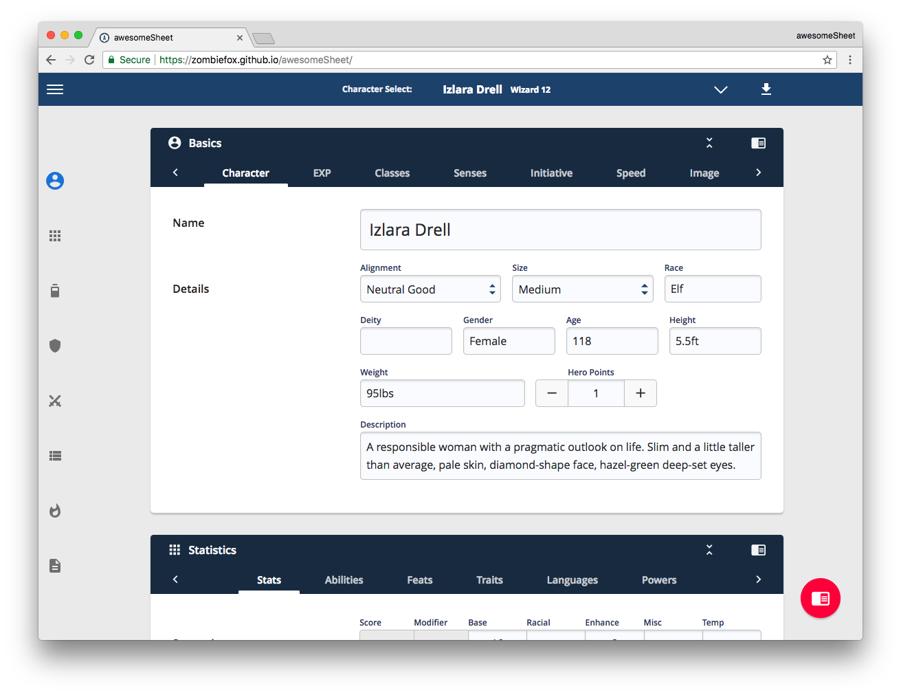
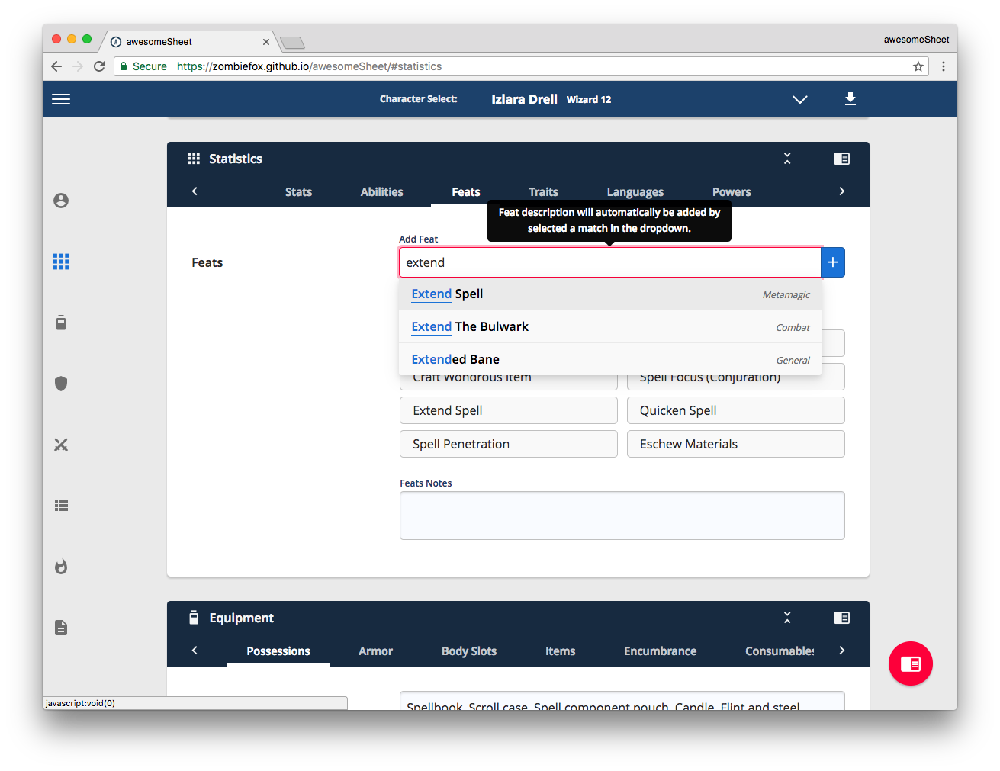
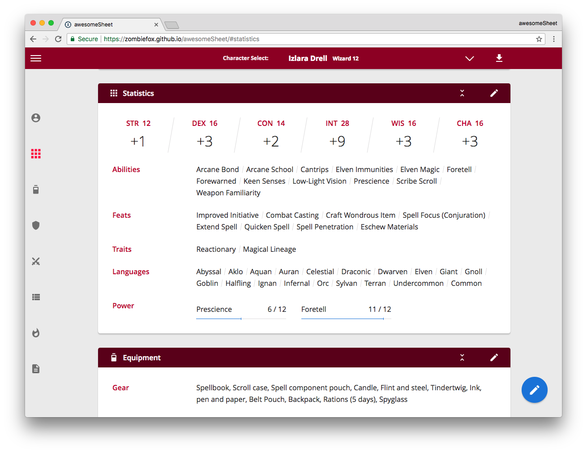

# awesomeSheet - Pathfinder Character Sheet
**A dynamic character sheet which auto calculates many scores and bonuses.**
### [See it in action](https://zombiefox.github.io/awesomeSheet/)

## Pathfinder Character Support
- Multiple Classes with automatic HP, BAB, Skill Ranks, Base Fortitude, Base Reflex and Base Will calculations.
- Initiative totalling with the ability to add any Stat Modifier as a bonus.
- Track Experience Points and Advancement Speed with automatic Level milestone calculations. Along with a Log to record when and how much Experience was added.
- Automatic Size and Special Size calculations. Bonuses applied to appropriate Skills, Offensive and Defensive stats with the option to change if needed.
- Character image with scale and position controls.
- Automatic Stats and Modifier calculations. Along with support for Racial, Enhancement, Miscellaneous and Temporary bonuses.
- Space for Class Abilities and accompanying notes.
- Feats, Traits and Language lookup populated with full descriptions.
- Track Class powers with Total and Used/Spent values.
- Space for Gear, Magical Gear, Potions and Scrolls.
- Track Items with automatic Weight, Values and Quantity totalling.
- Space for Armour and Shield information along with all Body Slots.
- Encumbrance automatic calculations for Light, Medium, Heavy, Lift and Drag loads. Along with support for an Alternative STR scores.
- Track Consumables with Total and Used/Spent values.
- Wealth tracking with automatic Currency (PP, GP, SP and CP) totalling. Along with a Log to record when Wealth was added.
- HP tracking with automatic Damage, Healing and Temp HP calculations.
- AC, Flat Footed, Touch AC, CMB and CMD totalling with the ability to add any Stat Modifier as a bonus.
- Fortitude, Reflex and Will totalling with the ability to add any Stat Modifier as a bonus.
- Add multiple Melee or Ranged Attacks.
- Skills and Custom Skills totalling with the ability to add any Stat Modifier as a bonus.
- Concentration and Caster Level Check totalling with the ability to add any Stat Modifier as a bonus.
- Spells lookup populated with full descriptions. Along with the ability to track Prepared, Cast and Active spells.
- Space to add multiple Character or Story Notes.

## Webapp Features

- Responsive web based app. (Can be "saved to home screen" on Android Chrome for app like experience)
- Offline use (Service Worker browsers [Chrome, Firefox]).
- Add multiple characters
- Export (Backup) and Import characters as JSON file.
- Display mode for reading when not editing.
- Keyboard shortcuts.
- Locally store all edits that will persist after page reload.

## JS/UI modular features
- Snack bars
- Tooltips
- Slide nav
- Modal prompts
- Night mode
- Input blocks
- Total blocks
- Static text blocks
- Clone blocks

## Development

Dependencies:
NodeJS, Grunt, Yarn

### To run local dev environment:

1. Clone repo and navigate to root
2. Run `npm install`
3. Run `yarn install`
4. Run `grunt dev`

A local server will launch on: http://0.0.0.0:9000/

### To build the project for production:

1. Run `grunt build`
